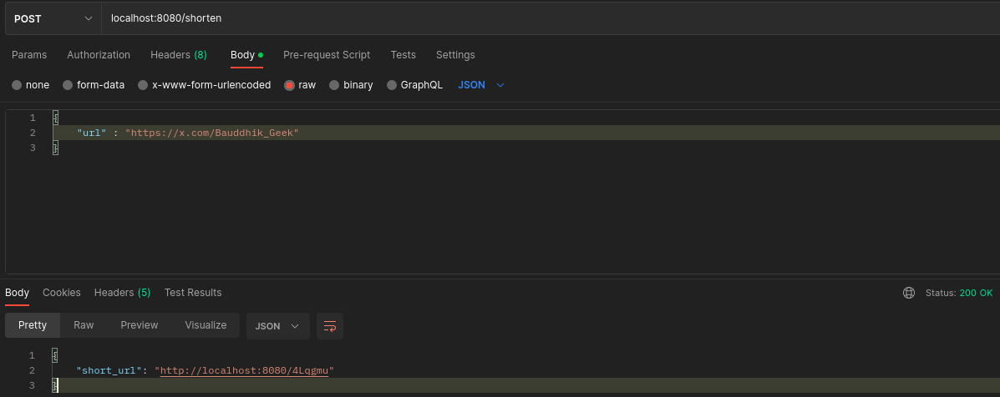
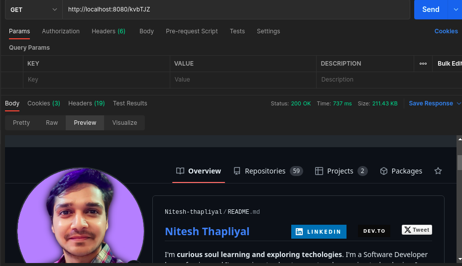
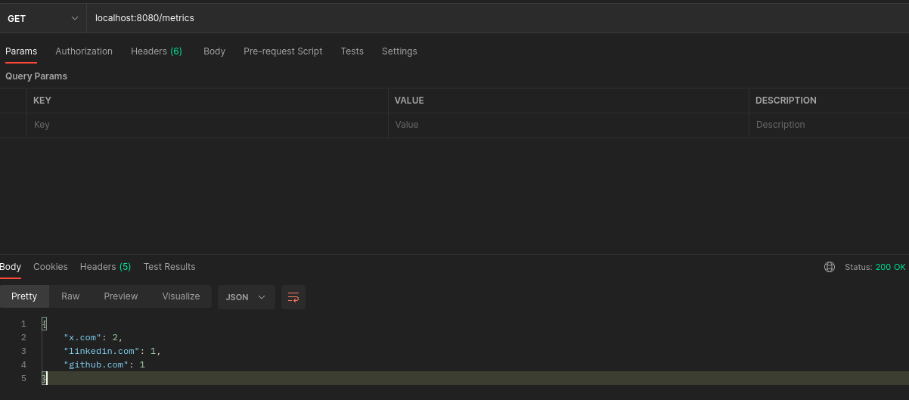
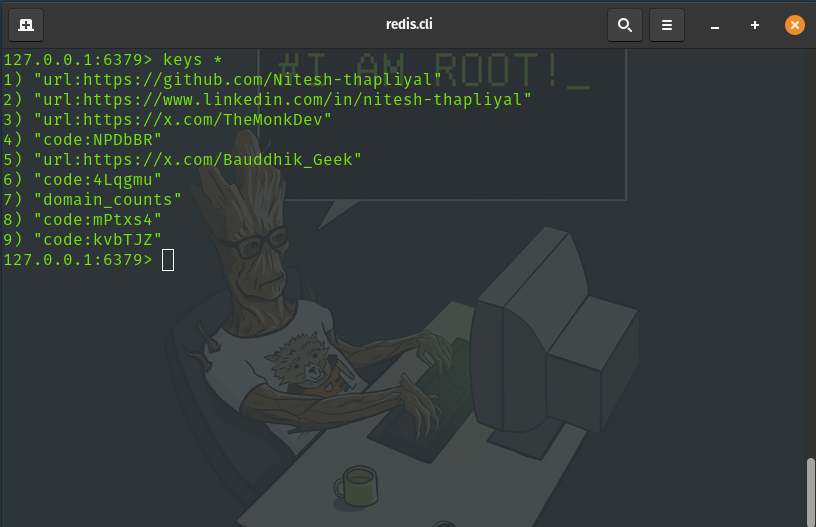

# URL Shortener Service

This is a simple URL shortener service built with Java Spring Boot. It provides a RESTful API for shortening URLs, redirecting shortened URLs, and retrieving usage metrics.

## Features

1. **URL Shortening**: Convert long URLs into short, easy-to-share links.
2. **URL Redirection**: Redirect users from shortened URLs to their original long URLs.
3. **Metrics**: Track and retrieve the top 3 domains that have been shortened most frequently.
4. **In-memory Storage**: Store URL mappings and metrics in Redis for fast access and persistence.

## API Endpoints

- `POST /shorten`: Shorten a long URL
  
- `GET /{shortCode}`: Redirect to the original long URL
  
- `GET /metrics`: Retrieve top 3 domains metrics
  

### Redis In-memory Storage



## Technologies Used

- Java 17
- Spring Boot 3.3.3
- Redis
- Maven
- Docker

## Setup and Running

### Local Setup

1. Ensure you have Java 17 and Maven installed on your system.
2. Install and start Redis on your local machine.
3. Clone the repository:
   ```
   git clone https://github.com/yourusername/url-shortener.git
   cd url-shortener
   ```
4. Update `src/main/resources/application.properties` with your Redis configuration if necessary.
5. Build the project:
   ```
   mvn clean package
   ```
6. Run the application:
   ```
   java -jar target/url-shortener-0.0.1-SNAPSHOT.jar
   ```
7. The service will be available at `http://localhost:8080`

### Docker Setup

1. Ensure you have Docker installed on your system.
2. Clone the repository:
   ```
   git clone https://github.com/yourusername/url-shortener.git
   cd url-shortener
   ```
3. Build the Docker image:
   ```
   docker build -t your-dockerhub-username/url-shortener .

   ```
4. Run Docker Container
    ```
    docker run -p 8080:8080 your-dockerhub-username/url-shortener

    ```

## Usage Examples

1. Shorten a URL:
   ```
   curl -X POST -H "Content-Type: application/json" -d '{"url":"https://www.example.com"}' http://localhost:8080/shorten
   ```

2. Redirect to a long URL:
   ```
   curl -I http://localhost:8080/{shortCode}
   ```

3. Get metrics:
   ```
   curl http://localhost:8080/metrics
   ```

## Running Tests

To run the unit tests, execute the following command:

```
mvn test
```
## Docker Image
You can find the Docker image for this project at:
- Docker Image Link: https://hub.docker.com/r/nitesh007/url-shortener

